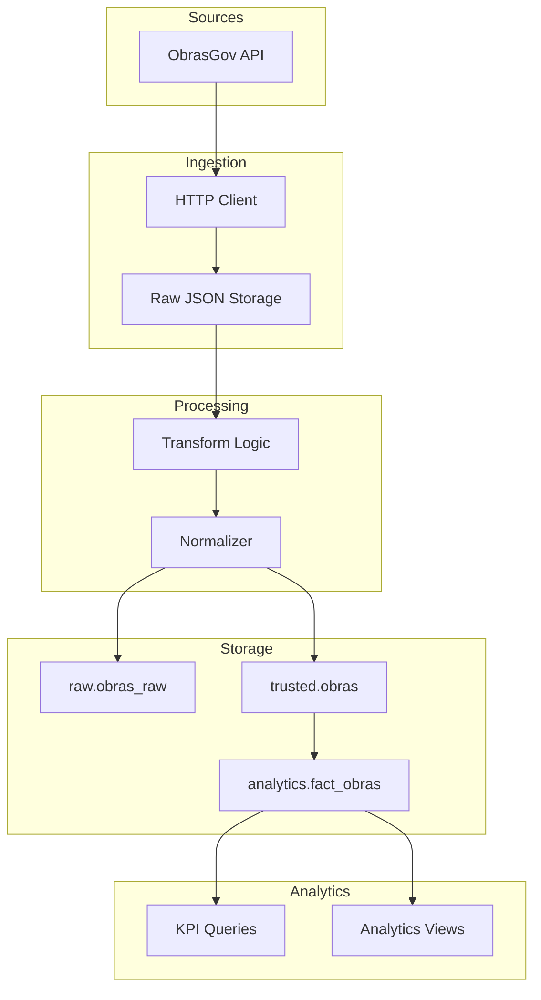

# Architecture Documentation

## System Design

### Overview

The Observatorio de Obras Publicas is a batch data pipeline designed to ingest, transform, and analyze Brazilian government infrastructure investment data. It follows the **medallion architecture** pattern with three distinct data layers.

### Architecture Diagram



## Layer Descriptions

### 1. Raw Layer

**Purpose**: Immutable storage of original API responses

**Characteristics**:
- Stores complete JSON payloads
- Preserves original field names and structures
- Contains metadata (ingestion_timestamp, source_system)
- Enables reprocessing from source

**Table**: `raw.obras_raw`
- `obra_id`: Primary key from source
- `payload`: Complete JSON response
- `ingestion_timestamp`: When data was fetched
- `source_system`: Source identifier

### 2. Trusted Layer

**Purpose**: Clean, validated, and normalized data

**Characteristics**:
- Standardized field naming
- Data type conversions
- Value normalization (status, regions)
- Handles missing data gracefully

**Table**: `trusted.obras`
- All raw fields normalized
- Added: `regiao` (region mapping)
- Added: `ingestion_timestamp`

### 3. Analytics Layer

**Purpose**: Business-ready analysis structures

**Components**:
- **Fact Table**: Quantitative metrics
- **Dimensions**: Descriptive attributes
- **Views**: Pre-computed KPIs

## Component Design

### Ingestion Component

```
┌─────────────────────────────┐
│    ObrasGovClient       │
├─────────────────────────────┤
│ - base_url             │
│ - timeout              │
│ - max_retries          │
├─────────────────────────────┤
│ + get_obras()          │
│ + get_obra_by_id()     │
│ + fetch_and_save_raw()  │
└─────────────────────────────┘
```

**Features**:
- Retry with exponential backoff
- Connection pooling via requests.Session
- Timeout enforcement
- Error handling
- Pagination support

### Transformation Component

```
┌─────────────────────────────┐
│   ObraNormalizer         │
├─────────────────────────────┤
│ - valid_statuses []     │
│ - valid_regions {}     │
├─────────────────────────────┤
│ + normalize_obra()     │
│ + normalize_batch()     │
│ + normalize_status()   │
│ + get_regiao()       │
│ + parse_decimal()     │
│ + parse_date()       │
└─────────────────────────────┘
```

**Features**:
- Multiple field name mappings
- Flexible date parsing
- Status standardization
- Region mapping (27 UFs → 5 regions)
- Graceful handling of nulls

### Loading Component

```
┌─────────────────────────────┐
│   PostgresLoader      │
├─────────────────────────────┤
│ - db_connection      │
├─────────────────────────────┤
│ + load_to_postgres() │
│ + load_from_file()   │
└─────────────────────────────┘
```

**Features**:
- Connection pooling
- Upsert (INSERT ON CONFLICT)
- Batch operations
- Transaction management

### Database Component

```
┌─────────────────────────────┐
│  DatabaseConnection    │
├─────────────────────────────┤
│ - _connection_pool   │
├─────────────────────────────┤
│ + get_connection()   │
│ + get_cursor()     │
│ + close_all()     │
└─────────────────────────────┘
```

**Features**:
- Threaded connection pool (10 max)
- Context manager support
- Auto-commit/rollback

## Data Flow

### ETL Pipeline

```
1. INGEST
   API → HTTP Request → JSON → file (raw/)

2. TRANSFORM
   file (raw/) → JSON parse → Normalize → file (processed/)

3. LOAD
   file (processed/) → Parser → PostgreSQL (raw, trusted, analytics)

4. ANALYZE
   PostgreSQL → SQL Queries → KPIs
```

### Idempotency

The pipeline is designed to be idempotent:
- Raw files are timestamped (no overwrite)
- Raw table uses ON CONFLICT DO UPDATE
- Trusted table uses ON CONFLICT DO UPDATE
- Dimensions use upsert with unique constraints

## Scalability Considerations

### Current (MVP)
- Batch processing
- PostgreSQL for storage
- Local file storage

### Future Evolution
- Airflow for orchestration
- dbt for transformations
- BigQuery/Snowflake for DW
- Kafka for streaming

## Security

- No credentials in code
- Environment variable configuration
- SSL/TLS for API calls
- PostgreSQL connection encryption

## Monitoring

- Structured logging (JSON format ready)
- Error tracking with context
- Health check endpoints
- Execution timestamps